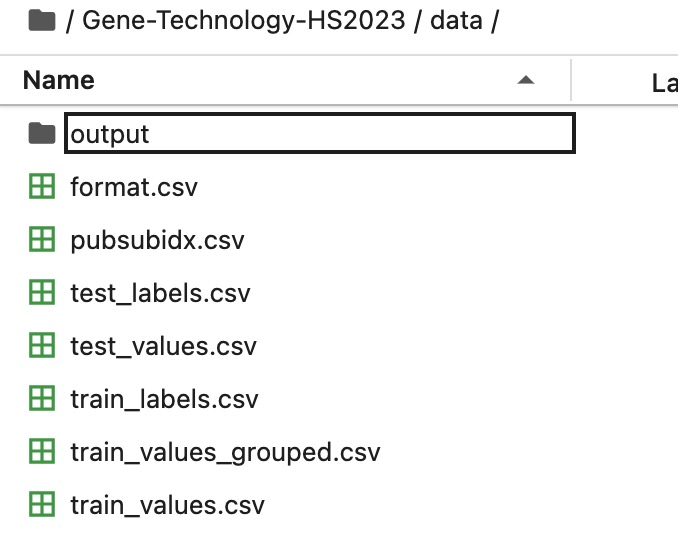

# Gene Technology HS2023 - Deep Metric Learning for Plasmid Origin Prediction

Welcome to the project repository for the lecture 535-0810-00L Gene Technology HS2023. This project is dedicated to showcasing the power of machine learning in solving pharmaceutical problems, in our case, prediction of the lab-of-origin, and serves as an educational tool for students. We've adapted the source code from "Deep Metric Learning Improves the Genetically Modified Plasmid Origin Prediction Laboratory" to further the state-of-the-art in predicting the origins of genetically modified plasmids. Additionally, we include more detailed explanations of the code and the underlying concepts, as well as a showcase of the results.

## Getting Started

These instructions will help you set up and run the project on your local machine or directly on Moodle using Jupyter Hub for educational and development purposes.

### Option1 : Using Jupyter Hub on Moodle (Recommended)

1. Open Jupyter Hub on Moodle.
2. Open the Terminal and use git to clone the project repository:
   ```
   git clone https://github.com/yihao-liu/Gene-Technology-HS2023.git
    ```
    
    
3. Rename the folder **data_to_use** with **data**.
4. Download the Data

    Before running the notebook, you will need to download the dataset required for this project. The dataset is composed of several `.csv` files, each serving a different purpose in the analysis.

    Please download the following files:

    - `format.csv`: The template file that illustrates the data format.
    - `pubsubindex.csv`: Contains index information.
    - `test_labels.csv`: The labels for the test dataset.
    - `test_values.csv`: The features for the test dataset.
    - `train_labels.csv`: The labels for the training dataset.
    - `train_values_grouped.csv`: Grouped values for the training dataset.
    - `train_values.csv`: The raw features for the training dataset.

    You can obtain these files from the following link: [Download Data](https://codeocean.com/capsule/3003146/tree/v1).

    After downloading, place all `.csv` files under the `data` folder in your project directory. The folder structure should be as follows:
    
    

    **Please note**: The uploading process might take several minutes. You can monitor the progress at the bottom of the webpage.
    


5. Navigate to the `Gene_Technology_showcase.ipynb` file under the folder **code** and click on it to open, select the **Gene Technology** kernel and run.

### Option 2: Local Setup
#### Prerequisites

1. **Python 3.6 or higher**: You can download it from [here](https://www.python.org/downloads/).
2. **Conda**: We recommend using Conda as a package and environment manager. Install it from [here](https://docs.conda.io/projects/conda/en/latest/user-guide/install/index.html).


#### Installation

1. Clone this repository:
    ```
    git clone https://github.com/yihao-liu/Gene-Technology-HS2023.git
    cd Gene-Technology-HS2023
    ```

2. Set up a Conda environment using the provided `environment.yml` file:
    ```
    conda env create -f environment.yml
    ```

3. Activate the Conda environment:
    ```
    conda activate your-env-name
    ```
Replace `your-env-name` with the name of the environment specified in the `environment.yml` file.


#### Usage

1. Rename the folder **data_to_use** with **data**.

2. Download the Data: 
   Before running the notebook, you need to download the data required for this project. Get the data from [this link](https://codeocean.com/capsule/3003146/tree/v1). Make sure to place it in the appropriate directory within your project folder as described before.

3. Launch Jupyter Notebook:
    ```
    jupyter notebook
    ```
This will open a new page in your web browser with a list of files in your current directory.

4. Navigate to the `Gene_Technology_showcase.ipynb` file and click on it to open.

5. Once inside the notebook, after select the **Gene Technology** kernel, you can run each cell by clicking on it and pressing `Shift+Enter`. This will execute the code inside the cell and move to the next one.

For a more detailed guide on using Jupyter Notebooks, please refer to the [official Jupyter documentation](https://jupyter-notebook.readthedocs.io/en/stable/notebook.html).

## To-Do

- [ ] Verify the `environment.yml` file.
- [ ] Clean up and organize the files contained in the project.

## Troubleshooting

Below are some common problems users may encounter, along with suggested solutions.

### Data Loading Issues

#### Issue 1: Index Error
**Symptom:**
When trying to load the data, you might receive an error indicating that the index is out of bounds, such as:
```
IndexError: positional indexers are out-of-bounds
```

**Possible Solutions:**
- **Data completeness:**
    Verify that all the necessary data files are present in the specified directory and uploaded correctly and completely.

#### Issue 2: Value Error
**Symptom:**
You might face issues when trying to predict the origin of a plasmid, such as:
```
ValueError: Shape of passed values is (20, 1314), indices imply (20, 1140)
```

**Possible Solutions:**
- **Check the shape and the values of Occurrences:**
    - The shape of the Occurrences should be `(1314,)`.
    - The values of the Occurrences should not include `nan`.
- **Data completeness:**
    Verify that all the necessary data files are present in the specified directory and uploaded correctly.


If you encounter any other issues not described above, consider reaching out for support.

## Acknowledgments

- The original [source code](https://codeocean.com/capsule/3003146/tree/v1) from "Deep Metric Learning Improves the Genetically Modified Plasmid Origin Prediction Laboratory".
- Prof. Dr. Klaus Eyer and Dr. Ines Lüchtefeld for their guidance and support.

## License

This project is licensed under the MIT License. For more details, see the [LICENSE.md](LICENSE.md) file.
